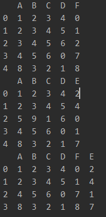
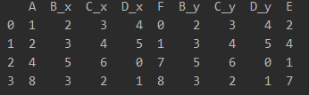
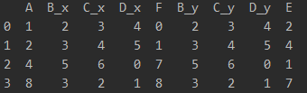
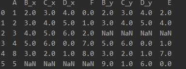
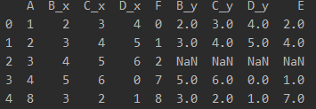
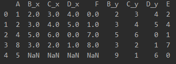

# concat
* 合并两个dataframe C = pd.concat([A, B], axis=0) 纵向拼接，只在其中一个dataframe中出现的列，置为NaN
```python
import pandas as pd

A = pd.read_csv('../src/data/A.csv')
B = pd.read_csv('../src/data/B.csv')
print(A)
print(B)

C = pd.concat([A, B])
print(C)

```
# combine_first
* A.combine_first(B), 使用B来填充A中为NAN的值，其中A会被修改。
```python
import pandas as pd

A = pd.read_csv('../src/data/A.csv')
B = pd.read_csv('../src/data/B.csv')
A.loc["A", "a"] = None
print(A)
print(B)

A.combine_first(B)
print(A)

```

# merge
* pd.merge(A, B) 按照A和B的属性交集相同的列进行合并

    

* pd.merge(A, B, on="A") 对于相同的列名，会加上后缀区分不同dataframe中的列

    

* 存在四种拼接方式：["inner", "outer", "left", "right"]
    * inner(默认值) 根据相同的参数on来进行拼接，这样就不会产生空值
    
        
    * outer 根据左右两边相同的参数on来进行拼接，若在A中出现的on那一列的值在B中没有出现，则在B中创建此行，其余列置为空，进行拼接
    
        
    * left 根据left的参数on来进行拼接，若在right中没有出现，则在right中创建此行，其余列置为空，进行拼接
    
        
    * right 根据right的参数on来进行拼接，若在在left中没有出现，则在left中创建此行，其余列置为空，进行拼接
    
        